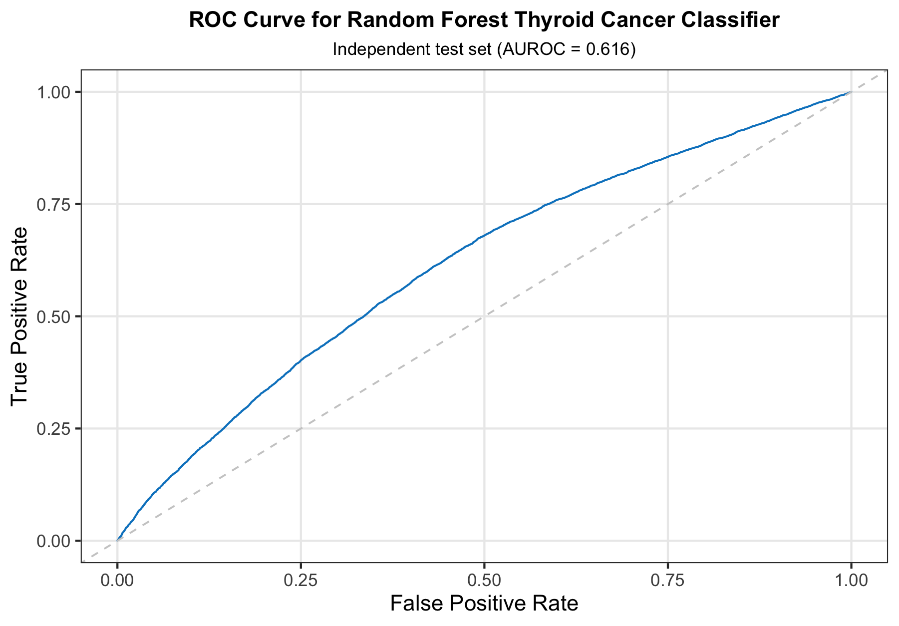
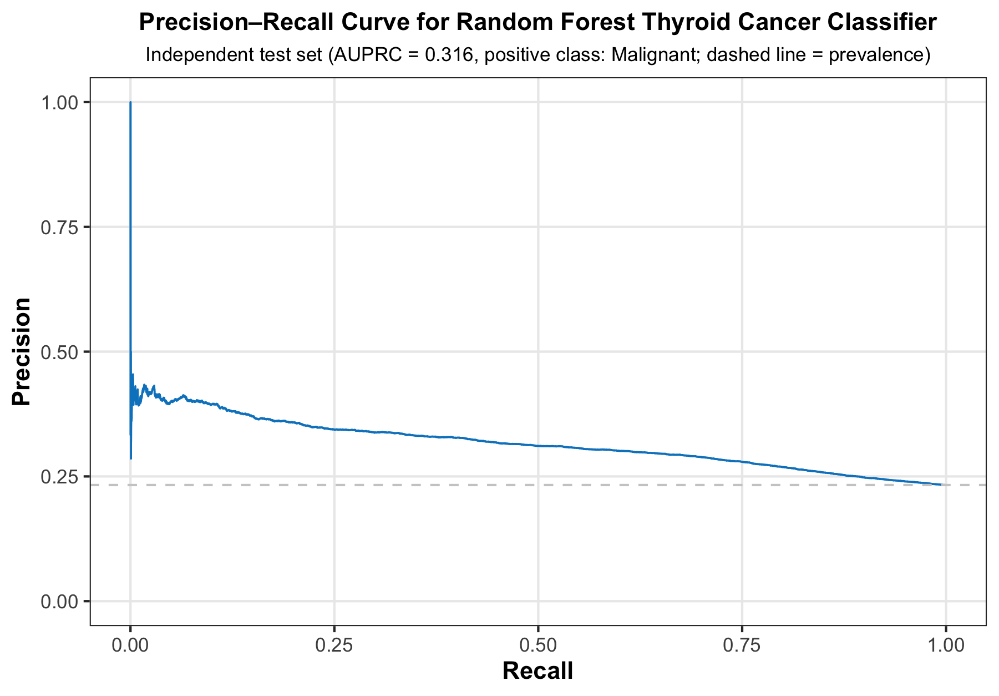
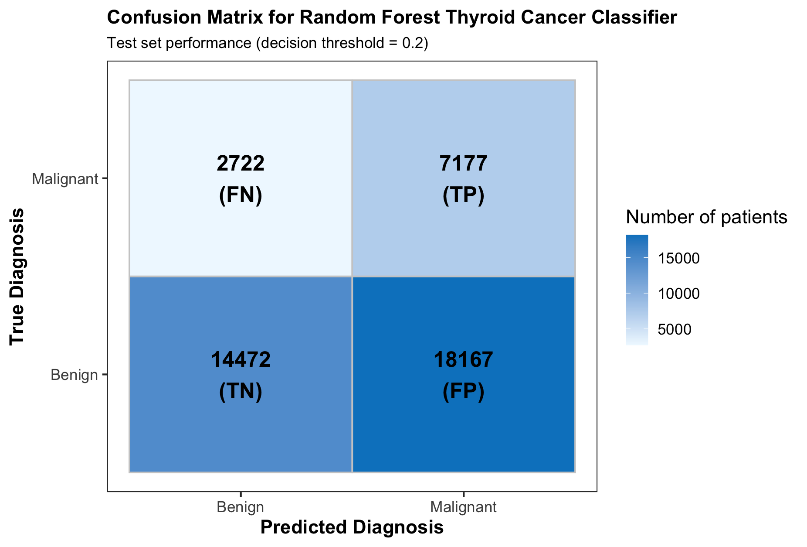
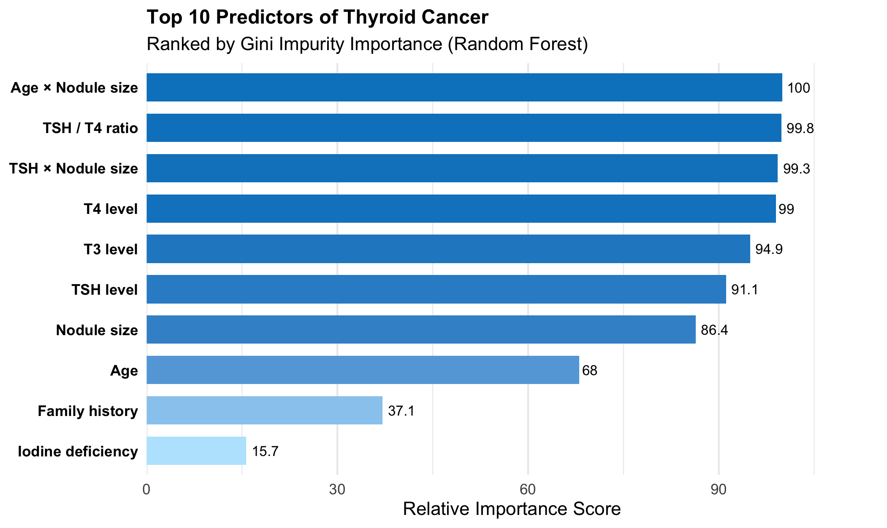
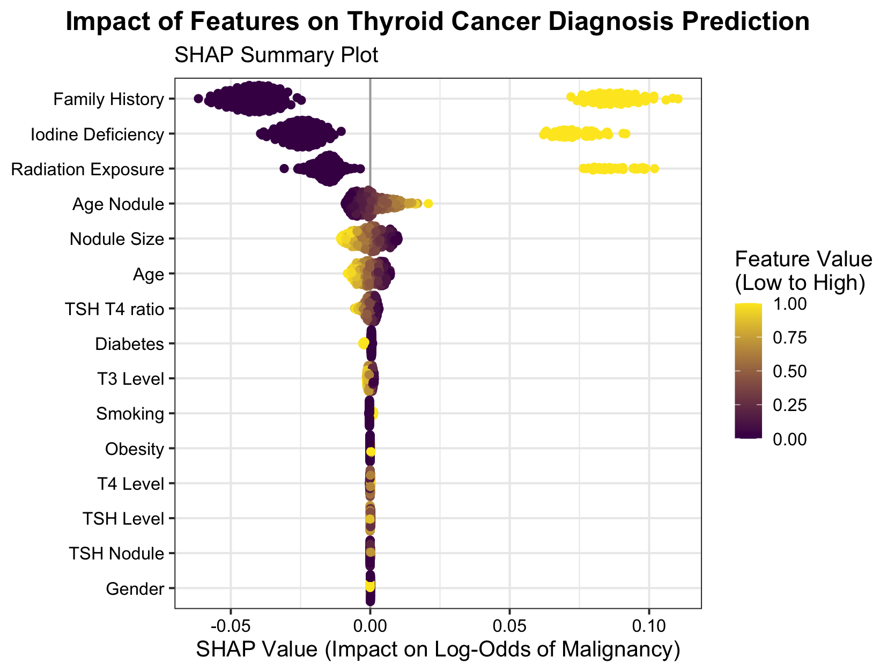

# ThyroidCancerPredictor

An R package for predicting thyroid cancer diagnosis (Benign vs
Malignant) using a trained Random Forest model.

## Installation

You can install the package directly from GitHub using the `remotes`
package:

``` r
if (!require(remotes)) install.packages("remotes")
remotes::install_github("BTZ23/ThyroidCancerPredictor")
```

## Usage

Load the package and prepare a sample patient record:

``` r
library(ThyroidCancerPredictor)

# Example patient data
patient <- data.frame(
  Age = 45,
  Gender = factor("Male", levels = c("Female", "Male")),
  TSH_Level = 2.5,
  T3_Level = 1.8,
  T4_Level = 7.8,
  Nodule_Size = 1.2,
  Family_History = factor(1, levels = c(0, 1)),
  Radiation_Exposure = factor(0, levels = c(0, 1)),
  Iodine_Deficiency = factor(0, levels = c(0, 1)),
  Smoking = factor(1, levels = c(0, 1)),
  Obesity = factor(0, levels = c(0, 1)),
  Diabetes = factor(0, levels = c(0, 1))
)

# Predict diagnosis
result <- predict_diagnosis(patient)
print(result)
```

You can also get model performance metrics and feature importance:

``` r
# Get model performance summary
perf <- get_model_performance()
print(perf)

# Get feature importance
imp <- get_feature_importance()
print(imp)
```

## Model Performance

The Random Forest model was trained on 212,691 samples with 14
clinical/demographic features.

### Key Metrics:

- **AUC (Area Under ROC Curve)**: 0.6147
- **Accuracy**: 0.5096
- **Sensitivity (Recall)**: 0.7253
- **Specificity**: 0.4442
- **Precision**: 0.3458
- **F1 Score**: 0.4687

### 1. ROC Curve

<div class="figure">


<p class="caption">
ROC Curve for Thyroid Cancer Prediction Model (AUC = 0.6147)
</p>

</div>

### 2. Precision-Recall Curve

<div class="figure">


<p class="caption">
Precision-Recall Curve for Thyroid Cancer Prediction
</p>

</div>

### 3. Confusion Matrix

<div class="figure">


<p class="caption">
Confusion Matrix for Random Forest Thyroid Cancer Classifier
</p>

</div>

## Feature Importance & Model Interpretation

### 4. Top 10 Predictors of Thyroid Cancer

<div class="figure">


<p class="caption">
Top 10 Predictors of Thyroid Cancer (Ranked by Gini Importance)
</p>

</div>

### 5. SHAP Summary Plot

<div class="figure">


<p class="caption">
Impact of Features on Thyroid Cancer Diagnosis Prediction (SHAP Values)
</p>

</div>

## Model Interpretation Insights

From the analysis:

1.  **Most Important Feature**: TSH/T4 ratio emerges as the strongest
    predictor, suggesting thyroid hormone balance is critical in cancer
    risk assessment.

2.  **Model Strengths**:

    - High sensitivity (72.5%) ensures most malignant cases are
      identified
    - AUC of 0.615 shows moderate discriminatory power

3.  **Clinical Relevance**:

    - The model can serve as a triage tool to prioritize high-risk
      patients
    - Feature importance aligns with clinical understanding of thyroid
      cancer risk factors

## Project Context

This R package was developed as part of the **BIO215 Capstone Project**.
The project involved three roles:

| Role | Responsibility           | Student      | ID      |
|------|--------------------------|--------------|---------|
| 1    | Machine Learning Modeler | Suyi Jiang   | 2360036 |
| 2    | Shiny Website Developer  | Fanjin Zeng  | 2364476 |
| 3    | R Package Developer      | Biting Zhang | 2360622 |

**Note**: This R package uses the same trained Random Forest model
deployed in the companion Shiny application, ensuring consistency across
platforms.

## Links

- **GitHub Repository**:
  <https://github.com/BTZ23/ThyroidCancerPredictor>  
- **Shiny Web Application**:
  \[<https://bio215p6.shinyapps.io/BIO215_Shiny/>\]  
- **Dataset Source**:
  <https://www.kaggle.com/datasets/mzohaibzeeshan/thyroid-cancer-risk-dataset>

## License

MIT License. See `LICENSE` file for details.
